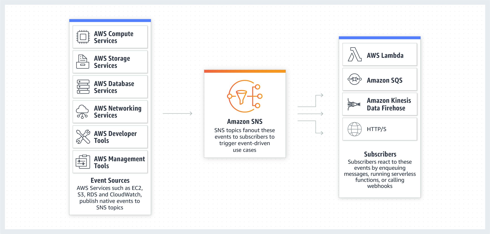

# AWS-SAA-C02 Study Notes

## EC2

Dimensions: vCPUs, Memory, Storage size and type and Network Performance

c4 Compute optimized—For workloads requiring significant processing
r3 Memory optimized—For memory-intensive workloads
i2 Storage optimized—For workloads requiring high amounts of fast SSD storage
g2 GPU-based instances—Intended for graphics and general-purpose GPU compute
workloads

AMIs: Snapshots of EC2 instances, they have os config, patches and apps.

Addressing Instances:

* Public Domain Name System (DNS) Name
* Public IP, it lives until the instance stops running
* Elastic IP, independent from instance state.

Security Groups: They are stateful firewalls.

Type of Security Group | Capabilities
EC2-Classic Security Groups | Control outgoing instance traffic
VPC Security Groups | Control outgoing and incoming instance traffic

Security group policies overlap, they don't cancel each other out or are mutually exclusinve.

Port, Protocol, Source/Destination

Bootstrapping instances: UserData field, you can add commands to execute at creation of instance.

VM Import/Export

You can get Instance Metadata from the AWS API.

Modifications after launch:

* Instance Type, you need to stop the isntance in order to do it.
* Security Grooups: Only if they are running within a VPC

**States**:

* Running is billed only.
* Stopping: Billed if preparing to hibernate
* Reserved Instances that applied to terminated instances are billed until the end of their term according to their payment option.
* All the rest are not billed.

**QUOTAS**

* On demand instances are limited per region to a default number of v-CPUs

Pricing:

* On-Demand: Standard type, the most flexible and expensive.
* Reserved instances: Specific instance type and AZ to save up to 75%, more long term commitment. 
  * All upfront
  * Partial upfront
  * Monthly basis
  * You cannot reserve capacity to multiple AWS Regions in a single RI purchase.
  * You can have capacity reservations that recur on a daily, weekly, or monthly basis, with a specified start time and duration, for a one-year term through **Scheduled Reserved Instances**
  * If you don't want to spend more: Terminate them ASAP and sell them in the Reserved Instance Marketplace.
* Spot instances: not time critical and tolerant to interruptions, set a bidding price.
* There is no charge for creating a placement group.
* Per Second Billing:
  * EC2 usage are billed on one second increments, with a minimum of 60 seconds
  * Avalilable for:
    * On-Demand, Reserved and Spot forms
    * All regions and Availability Zones  
    * Amazon Linux and Ubuntu

The more upfront, the bigger the discount.

Reservation changes:
* Switch Availability Zones within the same region.
* Change between EC2-VPC and EC2-Classic.
* Change the instance type within the same instance family (Linux instances only)

Tenancy: Shared (default), Dedicated Instances, Dedicated Host.

**Placement groups**: A placement group is a logical grouping of instances within a single Availability Zone. Placement groups enable applications to participate in a low-latency, 10 Gbps network.

* Strategies:
  * Cluster: packs instances close together inside an Availability Zone. Low latency performance, ideal for HPC.
  * Partition: instances in one partition do not share the underlying hardware with groups of instances in different partitions, ideal for replicated workloads, such as Hadoop, Cassandra, and Kafka.
  * Spread: strictly places a small group of instances across distinct underlying hardware to reduce correlated failures.
* Rules:
  * You can't merge placement groups.
  * An instance can be launched in one placement group at a time; it cannot span multiple placement groups
  * You cannot reserve capacity for a specific placement group, it's on an AZ level.
  * Name must be unique for the region and account.
  * For partitions, you cannot have more than 7 partitions per AZ.

Instance Store: Instance stores are included in the cost of an Amazon EC2 instance, so they are a very costeffective solution for appropriate workloads. The key aspect of instance stores is that they are temporary. 
Data in the instance store is lost when:
* The underlying disk drive fails.
* The instance stops (the data will persist if an instance reboots).
* The instance terminates.

**Elastic Network Adapter**

* high performance networking
* provides up to 20 Gbps of consistent, low-latency performance when used within a Placement Group, at no extra charge!
* ENA will scale as network bandwidth grows and the vCPU count increases

You are limited to running On-Demand Instances:
* per your vCPU-based On-Demand Instance limit
* purchasing 20 Reserved Instances
* requesting Spot Instances per your dynamic Spot limit per region

## EBS
* Each Amazon EBS volume is automatically replicated within its Availability Zone to protect you from component failure.
* Multiple Amazon EBS volumes can be attached to a single Amazon EC2 instance, although a volume can only be attached to a single instance at a time.
* EBS volumes support live configuration changes while in production. You can modify volume type, volume size, and IOPS capacity without service interruptions

Types of EBS Volumes:

* Magnetic Volumes
  * Workloads where data is accessed infrequently.
  * Sequential reads
  * NOT BOOTABLE!
  * Situations where low-cost storage is a requirement
  * **Throughput-Optimized HDD**: provides low-cost magnetic storage that defines performance in terms of throughput rather than IOPS. These volumes are ideal for large sequential workloads.
    * Frequently used data also.
  * **Cold HDD**:  provides low-cost magnetic storage that defines performance in terms of throughput rather than IOPS. These volumes are ideal for large, sequential, cold-data workloads. Cheapest of them all. 
    * Cold data.
* **General-Purpose SSD**
  * System boot volumes, Small- to medium-sized databases, Development and test environments
  * Can handle bursts of IOPS, IOPS credits and more...
* **Provisioned IOPS SSD**
  * Critical business applications that require sustained IOPS performance
  * Large database workloads
  * Max: 32,000 IOPS and 64,000 on Nitro instances.

Amazon EBS-Optimized Instances: Select them when using volumes other than magnetic, to improve EBS I/O, this adds a charge.

Protecting Data:
* Backup/Recovery (Snapshots): Through the AWS Management Console, Through the CLI, Through the API, By setting up a schedule of regular snapshots.
  * To use a snapshot you create a Volume from it. Use the same principle to increase volume size. 
  * Snapshots are publicly shareable. 
  * You can create multi-volume snapshots, which are point-in-time snapshots for all EBS volumes attached to an EC2 instance.

**Amazon Data Lifecycle Manager (Amazon DLM)**: 

* Automate the creation, retention, and deletion of snapshots taken to back up your Amazon EBS volumes.
* DLM also supports EBS-backed AMIs, they include an EBS snapshot for each volume attached to the source instance.
* Tags are used to select what to backup or not.
* You can create up to 100 lifecycle policies per Region.
* You can add up to 45 tags per resource.

Links:
* https://docs.aws.amazon.com/AWSEC2/latest/UserGuide/snapshot-lifecycle.html
* https://tutorialsdojo.com/amazon-ebs/%20?src=udemy
* http://docs.aws.amazon.com/AWSEC2/latest/UserGuide/EBSVolumes.html

**Encryption**: Amazon EBS offers native encryption on all volume types. When you launch an encrypted Amazon EBS volume, Amazon uses the AWS Key Management Service (KMS) to handle key management. A new master key will be created unless you select a master key that you created separately in the service. Your data and associated keys are encrypted using the industry-standard AES-256 algorithm.

* **EBS volumes are only encrypted using AWS KMS**

**Calculate the right IOPS and queue lenght**

* Transaction-intensive applications: maintain high IOPS while keeping latency down by maintaining a low queue length and a high number of IOPS available to the volume.
* Throughput-intensive applications: maintain high throughput to HDD-backed volumes by maintaining a high queue length when performing large, sequential I/O.
  * THe max IOPS for any volume 640 GiB in size or greater allows provisioning up to a maximum of 32,000 IOPS
  * Then you can infer the max iops from the drive-size with that relation and the set the queue size accordingly.

**Deletion**

By default, Amazon *EBS root device volumes are automatically deleted when the instance terminates*. However, by default, any additional EBS volumes that you attach at launch, or any EBS volumes that you attach to an existing instance persist even after the instance terminates. This behavior is controlled by the volume's `DeleteOnTermination` attribute, which you can modify.

* EBS Volumes attached to stopped EC2 Instances

## S3

* Server-side encryption
  * is about data encryption at rest
  * Amazon S3-Managed encryption keys (SSE-S3) using 256-bit Advanced Encryption Standard (AES-256) block cipher
    * It encrypts the key itself with a master key that it rotates regularly.
    * Request header for SSE-S3: `x-amz-server-side-encryption`
  * Customer provided encryption keys (SSE-C):
    * Headers: `x-amz-server-side​-encryption​-customer-algorithm` , `x-amz-server-side​-encryption​-customer-key` , `x-amz-server-side​-encryption​-customer-key-MD5`
* Deletion:
  * Enabling S3 Object Lock prevents your existing and future records from being deleted or overwritten.

* Client side encryption
  * How client-side encryption using *client-side master key* works:
    1. The Amazon S3 encryption client generates a one-time-use symmetric key (also known as a data encryption key or data key) locally. It uses the data key to encrypt the data of a single Amazon S3 object. The client generates a separate data key for each object.

    2. The client encrypts the data encryption key using the master key that you provide. The client uploads the encrypted data key and its material description as part of the object metadata. The client uses the material description to determine which client-side master key to use for decryption.

    3. The client uploads the encrypted data to Amazon S3 and saves the encrypted data key as object metadata `x-amz-meta-x-amz-key` in Amazon S3.
 * How client-side encryption using *KMS-managed customer master key* works: 
   * with a KMS-managed customer master key, you provide an AWS KMS customer master key ID (CMK ID) to AWS

**Constistency**

Amazon S3 provides eventual consistency for read-after-write. Amazon S3 offers eventual consistency for overwrite PUTS and DELETES in all regions

Amazon S3 achieves high availability by replicating data across multiple servers within Amazon's data centers. If a PUT request is successful, your data is safely stored. However, information about the changes must replicate across Amazon S3, which can take some time, and so you might observe the following behaviors:
- A process writes a new object to Amazon S3 and immediately lists keys within its bucket. Until the change is fully propagated, the object might not appear in the list.- A process replaces an existing object and immediately attempts to read it. Until the change is fully propagated, Amazon S3 might return the prior data.
- A process deletes an existing object and immediately attempts to read it. Until the deletion is fully propagated, Amazon S3 might return the deleted data.
- A process deletes an existing object and immediately lists keys within its bucket. Until the deletion is fully propagated, Amazon S3 might list the deleted object.

Amazon S3s support for *parallel requests* means you can scale your S3 performance by the factor of your compute cluster, without making any customizations to your application. Amazon S3 does not currently support Object Locking. If two PUT requests are simultaneously made to the same key, the request with the latest timestamp wins. If this is an issue, you will need to build an object-locking mechanism into your application.

You have the following options for protecting data at rest in Amazon S3:

Use Server-Side Encryption – You request Amazon S3 to encrypt your object before saving it on disks in its data centers and decrypt it when you download the objects.

Use Server-Side Encryption with Amazon S3-Managed Keys (SSE-S3)

Use Server-Side Encryption with AWS KMS-Managed Keys (SSE-KMS)

Use Server-Side Encryption with Customer-Provided Keys (SSE-C)

Use Client-Side Encryption – You can encrypt data client-side and upload the encrypted data to Amazon S3. In this case, you manage the encryption process, the encryption keys, and related tools.

Use Client-Side Encryption with AWS KMS–Managed Customer Master Key (CMK)

Use Client-Side Encryption Using a Client-Side Master Key

**S3 Access Points**

* Customers increasingly use Amazon S3 to store shared data sets, where data is aggregated and accessed by different applications, teams and individuals, whether for analytics, machine learning, real-time monitoring, or other data lake use cases. Managing access to this shared bucket requires a single bucket policy that controls access for dozens to hundreds of applications with different permission levels. As an application set grows, the bucket policy becomes more complex, time consuming to manage, and needs to be audited to make sure that changes don’t have an unexpected impact to an another application
* https://tutorialsdojo.com/amazon-s3-access-points/

**S3 Select**

* S3 Select enables applications to retrieve only a subset of data from an object by using simple SQL expressions. By using S3 Select to retrieve only the data needed by your application, you can achieve drastic performance increases.

* CSV: You can perform S3 Select to query only the necessary data inside the CSV files based on the bucket's name and the object's key.

**Notifications**

Amazon S3 can publish notifications for the following events:

1. New object created events

2. Object removal events

3. Restore object events

4. Reduced Redundancy Storage (RRS) object lost events

5. Replication events

Amazon S3 supports the following destinations where it can publish events:

1. Amazon Simple Notification Service (Amazon SNS) topic

2. Amazon Simple Queue Service (Amazon SQS) queue

3. AWS Lambda

* **Replication**
  * Asynchronous, between buckets from the same or different account.
  * Single destination bucket and Multiple destination buckets.
  * It's not retroactive.
    * You can enable "Replication for Existing Objects" via support ticket.
  * Versioning must be enabled in all buckets.
  * Permissions for replication must be provided.
  * If object lock is active at source, then destination must have it too.

**Privacy of Objects**

* all objects are private by default.
* the object owner can optionally share objects with others by creating a pre-signed URL, using their own security credentials, to grant time-limited permission to download the objects
* if you have a video in your bucket and both the bucket and the object are private, you can share the video with others by generating a pre-signed URL
* If you want all objects to be public
  * Grant public read access to the object when uploading each object using the S3 Console
  * Configure the S3 bucket policy to set all objects to public read

**Multipart Uploads**

* upload parts of your object in parallel thus, decreasing the time it takes to upload big objects
* Each part is a contiguous portion of the object's data
* If transmission of any part fails, you can retransmit that part without affecting other parts
* when your object size reaches 100 MB, you should consider using multipart uploads
* Improved throughput
* Pause and resume object uploads
* Begin an upload before you know the final object size, upload as you create an object.

**Performance**

* Amazon S3 now provides increased performance to support at least 3,500 requests per second to add data and 5,500 requests per second to retrieve data.
* Amazon S3's support for parallel requests means you can scale your S3 performance by the factor of your compute cluster, without making any customizations to your application. Performance scales per prefix, so you can use as many prefixes as you need in parallel to achieve the required throughput. There are no limits to the number of prefixes.
* The largest object that can be uploaded in a single PUT is 5 GB
* If you are using the multipart upload API, then the limit is 5 TB.
* This S3 request rate performance increase removes any previous guidance to randomize object prefixes to achieve faster performance.
* **Amazon S3 Transfer Acceleration**, you can speed up content transfers to and from Amazon S3 by as much as 50-500% for long-distance transfer of larger objects.
  * **Transfer Acceleration** bucket-level feature that enables fast, easy, and secure transfers of files over long distances between your client and an S3 bucket
  * Data is sent to edge locations, the data is routed to Amazon S3 over an optimized network path.

**Lifecycle Policies**

* add rules in a lifecycle configuration to tell Amazon S3 to transition objects to another Amazon S3 storage class
* you can transition the objects to the INTELLIGENT_TIERING storage class for automatic cost savings.
* Constraints with STANDARD_IA and ONEZONE_IA:
  * For larger objects, there is a cost benefit for transitioning to STANDARD_IA or ONEZONE_IA
  * Objects must be stored at least 30 days in the current storage class before you can transition them to STANDARD_IA or ONEZONE_IA. For example, you cannot create a lifecycle rule to transition objects to the STANDARD_IA storage class one day after you create them. This limitation **does not apply** on INTELLIGENT_TIERING, GLACIER, and DEEP_ARCHIVE storage class.

**Tiers**

Expedited retrievals in Glacier which will allow you to quickly access your data (within 15 minutes) 

* Provisioned capacity ensures that your retrieval capacity for expedited retrievals is available when you need it. Each unit of capacity provides that at least three expedited retrievals can be performed every five minutes and provides up to 150 MB/s of retrieval throughput. You should purchase provisioned retrieval capacity if your workload requires highly reliable and predictable access to a subset of your data in minutes.
* if you require access to Expedited retrievals under all circumstances, you must purchase provisioned retrieval capacity.

**Monitoring**

You can use AWS CloudTrail logs together with server access logs for Amazon S3. 
* CloudTrail logs provide you with detailed API tracking for Amazon S3 bucket-level and object-level operations, 
* while server access logs for Amazon S3 provide you visibility into object-level operations on your data in Amazon S3
* Server access logging includes: referrer and turn-around time information, which CloudTrail doesnt bring. 

Links:

* https://docs.aws.amazon.com/AmazonS3/latest/dev/serv-side-encryption.html

## AWS CloudWatch

Monitoring service for AWS cloud resources and the applications you run on AWS

* Default Metrics:
  * CPU Utilization
  * Network Utilization
  * Disk Reads
* To monitor custom metrics, you must install the CloudWatch agent on the EC2 instance.
  * Some custom metrics: 
    * Memory utilization
    * Disk swap utilization
    * Disk space utilization
    * Page file utilization
    * Log collection
* Lambda Metrics
  * Invocations 
  * AsyncDeliveryFailures
  * more here: https://docs.aws.amazon.com/lambda/latest/dg/monitoring-metrics.html

## VPC

The Amazon VPC service was released after the Amazon EC2 service; because of this, there
are two different networking platforms available within AWS: EC2-Classic and EC2-VPC.
Amazon EC2 originally launched with a single, flat network shared with other AWS
customers called EC2-Classic. As such, AWS accounts created prior to the arrival of the
Amazon VPC service can launch instances into the EC2-Classic network and EC2-VPC. AWS
accounts created after December 2013 only support launching instances using EC2-VPC. AWS
accounts that support EC2-VPC will have a default VPC created in each region with a default
subnet created in each Availability Zone. The assigned CIDR block of the VPC will be
172.31.0.0/16.

Your VPC automatically comes with a modifiable default network ACL. By default, it allows all inbound and outbound IPv4 traffic and, if applicable, IPv6 traffic.

**Subnets**:

AWS reserves the first four IP addresses and the last IP address of every subnet for internal networking purposes.

Subnets can be classified as public (traffic directed to IGW), private, or VPN-only (directed to VPG). The internal IP address range of the subnet is always private.

Default Amazon VPCs contain one public subnet in every Availability Zone within the region,
with a netmask of /20.

In cases where your EC2 instance cannot be accessed from the Internet (or vice versa), you usually must check two things:
- Does it have an EIP or public IP address?
- Is the route table properly configured?

Route Tables:
A route table is a logical construct within an Amazon VPC that contains a set of rules (called
routes) that are applied to the subnet and used to determine where network traffic is
directed. A route table’s routes are what permit Amazon EC2 instances within different
subnets within an Amazon VPC to communicate with each other

You should remember the following points about route tables:
* Your VPC has an implicit router.
* Your VPC automatically comes with a main route table that you can modify.
* You can create additional custom route tables for your VPC.
* Each subnet must be associated with a route table, which controls the routing for the
subnet. If you don’t explicitly associate a subnet with a particular route table, the subnet
uses the main route table.
* You can replace the main route table with a custom table that you’ve created so that each
new subnet is automatically associated with it.
* Each route in a table specifies a destination CIDR and a target; for example, traffic
destined for 172.16.0.0/12 is targeted for the VPG. AWS uses the most specific route that
matches the traffic to determine how to route the traffic.

Internet Gateways:
An IGW provides a target in your Amazon VPC route tables for Internet-routable
traffic, and it performs network address translation for instances that have been assigned
public IP addresses.

You must do the following to create a public subnet with Internet access:
* Attach an IGW to your Amazon VPC.
* Create a subnet route table rule to send all non-local traffic (0.0.0.0/0) to the IGW.
* Configure your network ACLs and security group rules to allow relevant traffic to flow to and from your instance.

Subnets and IP Addreses:

* By default, nondefault subnets have the IPv4 public addressing attribute set to false, and **default subnets have this attribute set to true**. An **exception is a nondefault subnet** created by the Amazon EC2 launch instance wizard — the wizard sets the attribute to true. You can modify this attribute using the Amazon VPC console.

* You need to add IPv4 subnet first before you can create an IPv6 subnet

When you launch an EC2 instance into a default VPC, AWS provides it with public and private DNS hostnames that correspond to the public IPv4 and private IPv4 addresses for the instance.

However, when you launch an instance into a non-default VPC, AWS provides the instance with a private DNS hostname only. 

New instances will only be provided with public DNS hostname depending on these two DNS attributes: 
 * the DNS resolution and DNS hostnames, that you have specified for your VPC, and if your instance has a public IPv4 address

DHCP:

Elastic IPs:
You must first allocate an EIP for use within a VPC and then assign it to an instance.
EIPs are specific to a region (that is, an EIP in one region cannot be assigned to an
instance within an Amazon VPC in a different region).
There is a one-to-one relationship between network interfaces and EIPs.
You can move EIPs from one instance to another, either in the same Amazon VPC or a
different Amazon VPC within the same region.
EIPs remain associated with your AWS account until you explicitly release them.
There are charges for EIPs allocated to your account, even when they are not associated with a resource

Elastic Network Interface:

**VPC Peering**

This is not transitive, meaning that if a VPC1 and VPC2 are peered and VPC1 has a NAT Gateway, VPC2 cant access the internet via it's peer connection and then gateway.
Edge to Edge routing via a gateway is not valid.

**Transit Gateway**:

* interconnect your virtual private clouds (VPCs) and on-premises networks through a central hub.
* This simplifies your network and puts an end to complex peering relationships. 
* As you expand globally, inter-Region peering connects AWS Transit Gateways together using the AWS global network
* It acts as a cloud router – each new connection is only made once.
* Your data is automatically encrypted, and never travels over the public internet.

Pricing:

* you are charged for the number of connections that you make to the Transit Gateway per hour and the amount of traffic that flows through AWS Transit Gateway.
* Per connection and per GB.

**VPC Endpoints**

* Connect with services within AWS. 
  * Gateway or Inteface Endopoints
    * Use Gateway Endpoints with S3 and DynamoDB
    * Use Interface Endpoints with all the other services.

**NAT**

THIS IS A IPV4 ONLY SERVICE, for IPv6 traffic use *egress-only Internet gateway*.

* NAT Gateway:
  * Managed service, Can scale up to 45 Gbps, optimized for handling NAT traffic
    * Charged depending on the number of NAT gateways you use, duration of usage, and amount of data that you send through the NAT gateways.	
    * Uses Elastic IP
* NAT Instances:
  * Use a script to manage failover between instances.
  * Bandwith: Depends on the bandwidth of the instance type
  * It's a generic Amazon Linux AMI that's configured to perform NAT.

To create a NAT gateway:
* you must specify the *public subnet* in which the NAT gateway should reside.
*  You must also specify an *Elastic IP address* to associate with the NAT gateway when you create it
   * The Elastic IP address cannot be changed once you associate it with the NAT Gateway.
 * After you've created a NAT gateway, you must update the route table associated with one or more of your private subnets to point Internet-bound traffic to the NAT gateway
 * Each NAT gateway is created in a specific Availability Zone and implemented with redundancy in that zon
 * You have a limit on the number of NAT gateways you can create in an Availability Zone.

* https://docs.aws.amazon.com/vpc/latest/userguide/vpc-nat-comparison.html

**How to create a VPN connection to a corporate network?**

To create a VPN connection, you must create a customer gateway resource in AWS, which provides information to AWS about your customer gateway device. Next, you have to set up an Internet-routable IP address (static) of the customer gateway's external interface. 
You can enable access to your network from your VPC by attaching a virtual private gateway to the VPC, creating a custom route table, updating your security group rules, and creating an AWS managed VPN connection.

https://docs.aws.amazon.com/AmazonVPC/latest/UserGuide/VPC_VPN.html
https://docs.aws.amazon.com/vpc/latest/userguide/SetUpVPNConnections.html

**Bastion**:

* A bastion host is a special purpose computer on a network specifically designed and configured to withstand attacks.
* It should be in a public subnet with either a public or Elastic IP address.
* It is used to gain access to a subnet from outside the VPC (i.e corporate network).

Links:
* Bastion: https://docs.aws.amazon.com/quickstart/latest/linux-bastion/architecture.html

**Multicast Networking**:

* Multicast Nworking is not supported by VPC, you will have to implement it at OS level in you compute resources.

**EC2-VPC vs EC2-Classic**

* EC2-Classic:
  * your EC2 instance receives a **private IPv4 address** from the EC2-Classic range **each time** it's started
* EC2-VPC:
  * your EC2 instance receives a **static private IPv4 address** from the address range of your default VPC

How to access an EC2 instance from the internet?

1. An Internet Gateway (IGW) attached to the VPC
2. A route entry to the Internet gateway in the Route table of the VPC.
3. A Public IP address attached to the EC2 instance

## RDS

* Parameter Groups can be used to apply the same set of settings to a a group of instances.
* Multi-AZ deployments: Creating Multi-AZ DB Instance automatically creates a primary DB Instance and synchronously replicates the data to a standby instance.
  * When the primary instance fails the CNAME is swithed from the primary to the standby instance which is promoted.
  * Failover conditions:
    * Loss of availability in primary Availability Zone
    * Loss of network connectivity to primary
    * Compute unit failure on primary
    * Storage failure on primary
  * AUTOMATIC FAILOVER IS ONLY AVAILABLE FOR MULTI-AZ deployments, NOT Multi Region ones. https://aws.amazon.com/rds/features/multi-az/
    * Read replicas are not promoted, standby instances are promoted. Aurora can promote read-replicas.
* IAM DB Authentication
  * authenticate to your DB instance using AWS Identity and Access Management (IAM) database authentication
  * works with MySQL and PostgreSQL
  * you don't need to use a password when you connect to a DB instance. Instead, you use an authentication token.
  * Benefits:
    * encrypted using Secure Socket Layer (SSL) or Transport Layer Security (TLS).
    * IAM to centrally manage access to your database resources, instead of managing access individually on each DB instance.
    * use profile credentials specific to your EC2 instance to access your database instead of a password.
* **SSL Encryption**
  * You will have to enable force-SSL encryption in RDS Instance, then reboot.
  * You will download the automatically generated SSL Cert from RDS and use it your instances in order to access RDS DBs.

**Monitoring**:
* **Enhanced Monitoring** metrics are useful when you want to see how different processes or threads on a DB instance use the CPU.
* CloudWatch gathers metrics about CPU utilization from the hypervisor for a DB instance while RDS Enhanced Monitoring gathers its metrics from an agent on the instance, more precision and granularity.

**Migration**:

* AWS Database Migration Service helps you migrate databases to AWS quickly and securely
  * supports homogeneous migrations such as Oracle to Oracle, as well as heterogeneous migrations between different database platforms, as well as from one RDS database to another RDS database
  * Steps:
    * First use the AWS Schema Conversion Tool to convert the source schema and code to match that of the target database.
    * then use the AWS Database Migration Service to migrate data from the source database to the target database
* It's kinda priced like EC2 instances

**Not supported**:
* Oracle RMAN and RAC are not supported in RDS

**Billing**:
* RDS is billed by the follwing components:
  * DB Instance Hours
  * Storage per GB per Month
  * I/O Requests per 1 Million requests per month.
  * Provisioned IOPS
  * Backup Storage GB per month.
  * Data Transfer per GB.

You can request an On-Demand instance or Reserved Instance.

Links:
* https://aws.amazon.com/rds/features/multi-az/

## Route53

* Routing Policies: 
  * Geolocation: route traffic based on the geographic location of your users, meaning the location that DNS queries originate from
    * Uses: restrict distribution of content, balancing load across endpoints, etc.
  * Geoproximity: route traffic to your resources based on the geographic location of your users and your resources. 
    * You can also optionally choose to route more traffic or less to a given resource by specifying a value, known as a bias. 
    * A bias expands or shrinks the size of the geographic region from which traffic is routed to a resource.
  * Latency: serve user requests from the AWS Region that provides the lowest latency. 
    * It does not, however, guarantee that users in the same geographic region will be served from the same location
  * Weighted: associate multiple resources with a single domain name or subdomain name and choose how much traffic is routed to each resource.
* Failovers:
  * Set failovers to  static S3 websites bucket or CloudFront distributions is possible.

*Routing traffic to a website that is hosted in an Amazon S3 Bucket*:
1. An S3 bucket that is configured to host a static website. The bucket must have the same name as your domain or subdomain. For example, if you want to use the subdomain portal.tutorialsdojo.com, the name of the bucket must be portal.tutorialsdojo.com
2.  registered domain name. You can use Route 53 as your domain registrar, or you can use a different registrar
3.  Route 53 as the DNS service for the domain. If you register your domain name by using Route 53, we automatically configure Route 53 as the DNS service for the domain.

*Routing traffic to an ELB load balancer*

* use Amazon Route 53 to create an alias record that points to your load balancer.
* Alias with a type "AAAA" record set and Alias with a type "A" record set, AAAA for IPV6.

**Supported Record Types**:

- A (address record)
- AAAA (IPv6 address record)
- CNAME (canonical name record) (NOT FOR APEX)
- CAA (certification authority authorization)
- MX (mail exchange record)
- NAPTR (name authority pointer record)
- NS (name server record)
- PTR (pointer record)
- SOA (start of authority record)
- SPF (sender policy framework)
- SRV (service locator)
- TXT (text record)

Failovers:
* Active Passive:
  * you want a primary resource or group of resources to be available the majority of the time and you want a secondary resource or group of resources to be on standby in case all the primary resources become unavailable
* Active Actvie
  * You configure active-active failover using any routing policy (or combination of routing policies) other than failover
  * using the failover routing policy
  * you want all of your resources to be available the majority of the time. When a resource becomes unavailable, Route 53 can detect that it's unhealthy and stop including it when responding to queries
  * active-active failover, all the records that have the same name, the same type (such as A or AAAA), and the same routing policy (such as weighted or latency) are active unless Route 53 considers them unhealthy
* Combination
https://aws.amazon.com/premiumsupport/knowledge-center/route-53-dns-health-checks/#:~:text=Active-active%20failover,for%20both%20resources%20before%20proceeding.

**DNSSEC**: Verify origin IPs and integrity, prevent phishing and sppofing.

## Auto Scaling

* Scheduled
* Predictive: . Predictive scaling uses machine learning to analyze each resource’s historical workload and regularly forecasts the future load for the next two days.
* Dynamic: Dynamic scaling creates target tracking scaling policies for the resources in your scaling plan
* **Default termination policy**:
  1. If there are instances in multiple Availability Zones, choose the Availability Zone with the most instances and at least one instance that is not protected from scale in. If there is more than one Availability Zone with this number of instances, choose the Availability Zone with the instances that use the oldest launch configuration.

  2. Determine which unprotected instances in the selected Availability Zone use the oldest launch configuration. If there is one such instance, terminate it.

  3. If there are multiple instances to terminate based on the above criteria, determine which unprotected instances are closest to the next billing hour. (This helps you maximize the use of your EC2 instances and manage your Amazon EC2 usage costs.) If there is one such instance, terminate it.

  4. If there is more than one unprotected instance closest to the next billing hour, choose one of these instances at random.

## Identity and Access Management 

Principals:

An entity that is allowed to interact with Resources. Root user, IAM Users and Roles/Temporary Security Tokens

IAM Policies: They are attached to principals. They contain permissions, each permission is composed of (Effect - allow/deny, Service, Resource - arn), Action, Condition)

**AWS Security Token Service**:

* Temporary credentials are useful in scenarios that involve identity federation, delegation, cross-account access, and IAM roles.
* Enterprise identity federation: authenticate users in your organization's network, and then provide those users access to AWS without creating new AWS identities.
  * Custom federation broker
  * Federation using SAML 2.0
* Web identity federation: users sign in using a well-known third party identity provider such as Login with Amazon, Facebook, Google, or any OpenID Connect (OIDC) 2.0 compatible provider
  * supports Login with Amazon, Facebook, Google, and any OpenID Connect (OIDC)-compatible identity provider.
* Cross Account Access: 

If you have an LDAP on-premise service that is not SAML compatible, in order to integrate with IAM:
* Develop an on-premises custom identity broker application and use STS to issue short-lived AWS credentials.
* if it is SAML compatible: https://docs.aws.amazon.com/IAM/latest/UserGuide/id_roles_providers_saml.html

## EFS: Elastic File System

* Multiple EC2 instances can acces EFS at the same time.
  * Ideal for concurrency block storage, if there's no concurrency issues then you might as well use plain EBS.

## SQS

* Types of queues:
  * Standard Queue offers nearly unlimited throughput. At-least once delivery, Best-Effort Ordering. 
  * FIFO Queue with throughput limited to 300 TPS and up to 3000 messages per second. Messages sent only once,
* Redundant within 3 AZs.
* Messages are retained for up to 14 days.
* Scales automatically up and down.
* Messages can contain up to 250KB of text data.
* Important parameters:
  * Message Retention Period: Retention if it's not deleted. Between 1 min and 14 days.
  * Max message size: 1KB to 250KB.
  * Delivery Delay: This is visibility period, time between sending and the message being visible to consumers. From 0 to 15 mins. For standard a change is not Retroactive for FIFO it is.
  * Recieve message wait time: Short (wait-time == 0s) or long polling (waiting from 1 to 20 secs), the latter reduces costs since it eliminates empty messages. 
  * Content based deduplication: ONLY FIFO, you enable hashing of the body with SHA256 to generate a content-based deduplication ID.
* Dead letter queues are supported.
* Server-side encryption is supported with keys managed my KMS.
* You cannot set a priority to individual items in the SQS queue

## DynamoDB

* DDB Streams enables publishing modification events on a table that can be captured by lambdas polling the stream.
* In-Memory Acceleration with DynamoDB Accelerator (DAX): primarily used for read performance improvement of your DynamoDB table from milliseconds response time to microseconds.
* Auto Scaling is **not enabled** in a DynamoDB table which is created using the AWS CLI

## AWS Lambda

* Deployment configuration types:
  * Canary: Traffic is shifted in two increments. Replace certain percentage, wait some time, then replace the rest.
  * Linear: Increments between intervals until it's complete.
  * All-at-once: All traffic is shifted from the original Lambda function to the updated Lambda function version all at once.
* Languages supported: Java, Nodejs, Python, C#, GO, PowerShell, Ruby
* Memory range: 128mb to 300mb. 
* TMP disk capacity: 512mb
* File descriptors and processes: both 1024
* Function timeout: 900s
* Concurrent executions: 1000 default, can be increased via support ticket.
* Deployment package size: 50zip, 250mb unzipped
* Deployment packages size per region: 75gb.
* Usage patterns: Real-time File Processing, Stream Processing, ETL, Replacing CRON, Processing AWS Events i.e CloudTrail
* Environment Vars Encryption:
  * They are not encrypted by default, you have to do it with KMS. 
  * When creating lambdas, a KMS default key is created, but you have to create your own for it to work.
  * Use encryption helpers and use KMS to encrypt environment variables after your Lambda function is created, you must create your own AWS KMS key and choose it instead of the default key.
* Lambda functions cannot connect directly to a VPC with dedicated instance tenancy. 
  * To connect to resources in a dedicated VPC, peer it to a second VPC with default tenancy.
  * If your Lambda function accesses a VPC, you must make sure that your VPC has sufficient ENI capacity to support the scale requirements of your Lambda function
  * By specifying subnets in each of the Availability Zones, your Lambda function can run in another Availability Zone if one goes down or runs out of IP addresses. If your VPC does not have sufficient ENIs or subnet IPs, your Lambda function will not scale as requests increase, and you will see an increase in invocation errors with EC2 error types like EC2ThrottledException.

## API Gateway

create, publish, maintain, monitor, and secure APIs at any scale

* Types: REST API, WebSocket API, HTTP API (Proxy to http backends or Lambda).
* It provides
  * Resiliency and scale
  * Request caching.
  * Security features: IAM, cognito etc
  * Metering: define plans that meter and restrict third-party developer access to your APIs. Visualize API Key usage and generate Keys as well.
  * Monitoring dashboard.
  * Deployment stages.
  * Open API Spec support.
  * SDK generation for iOS, Android and JS.

* Enables you to build RESTful APIs and WebSocket APIs that are optimized for serverless workloads
* You pay only for the API calls you receive and the amount of data transferred out.
* HTTP is not supported, only HTTPS.

API owners can set a rate limit of 1,000 requests per second for a specific method in their REST APIs, and also configure Amazon API Gateway to handle a burst of 2,000 requests per second for a few seconds. *Any request over the limit will receive a 429 HTTP response*

* You can enable throttling limits and result caching in API Gateway
  * Amazon API Gateway provides throttling at multiple levels including global and by a service call. Throttling limits can be set for standard rates and bursts
  
## Kinesis

Build real-time streaming analytics and real-time apps.

Sub-products: Kinesis Data Streams, Kinesis Data Firehose, Kinesis Data Analytics, Kinesis Video Streams.

Data Streams:
* Process and analyze streaming data, using Kinesis Client Library.
* Create a stream and publish with Kinesis Producer Library and then consume with Kinesis Client Library.
* You can have multiple consumers. E.g one processing for analytics and one dumpling the data to s3.
* The streaming data is replicated to 3 AZs within a region.
* You can retain data for up to 7 days as max increase, othewise 24h.
* Components:
  * Data Stream: Logical grouping of shards.
  * Shard: Append only log, ingest up to 1000 records per second, up to 5 read transactions per second. Default limit of 500 shards, but you can request an increase to unlimited shards.
  * Partition Key, Sequence Number and Data Blob conform a RECORD.
* Performance:
  * More shards, more expensive, more data capacity.
  * You can do resharding: shard split and shard merge. This is done by pairs, i.e you cannot split or merge by more than 2 shards at a time.
  * Scale without limits via incresing shards, do it it the *UpdateShardCount* command.
* Pricing: 
  * Charged by shard by hourly rate.
  * Per million payloads billing.
* KCL: Kinesis Client Library
  * Watch out for lease table write capacity (DynamoDB)!
* Lambda can process up to **10 batches in each shard simultaneously**
* 

**Kinesis Data Streams stores data for later processing by applications (key difference with Firehose which delivers data directly to AWS services).**

Firehose:
* You can load streaming data into data stores.
* You pay only for the data you transmit.
* The streaming data is replicated to 3 AZs within a region.
* Ideal technology for an EVENT STORE, in case you app is event-sourced.
* A delivery stream is the underlying entity of Amazon Kinesis Data Firehose.

Firehose Destinations include:
* Amazon S3.
* Amazon Redshift.
* Amazon Elasticsearch Service.
* Splunk.

Data Analytics:
* Use standard SQL to process and analyze streams.
* Simply point Kinesis Data Analytics at an incoming data stream, write your SQL queries, and specify where you want to load the results. The queries run continously.

Use cases: Real-time Time Series analytics, Feed real-time dashboards, Real-time alarms and notifications. 

Links: 

* https://tutorialsdojo.com/amazon-kinesis/?src=udemy
* KCL: https://docs.aws.amazon.com/streams/latest/dev/shared-throughput-kcl-consumers.html#shared-throughput-kcl-consumers-overview

## AWS Elastic BeanStalk

You can deploy Web Server based apps and Worker based apps (a background process listening to SQS). EVERYTHING IS MANAGED.

* Components of a Beanstalk app:
  * Environment: Infrastructure supporting the app, you can define multiple envoronments: DEV, STG and PRD for example.
  * Application Varsion: Your app code, stored in S3.
  * Saved Configuration: It defines how an environment and its resources should behave.
* You can deploy single-instance or multi instance. AWS provisions the necessary load-balancers and other stuff.
  * Database runs on RDS and is optional.
* You can add AWS Elastic Beanstalk configuration files to your web application’s source code to configure your environment and customize the AWS resources that it contains.
* Developement stacks supported:
  * Apache Tomcat for Java applications
  * HTTP Server for PHP applications
  * HTTP Server for Python applications
  * Nginx or Apache HTTP Server for Node.js applications
  * Passenger or Puma for Ruby applications
  * Microsoft IIS 7.5, 8.0, and 8.5 for .NET applications
  * Java SE
  * **Docker**
  * Go

## Amazon Cognito
User identity and data synchronization service that makes it really easy for you to manage user data for your apps across multiple mobile or connected devices

* You can create identities for users from login providers like Google, FB, Amazon and enterprise like Active Directory SAML.
* It supports unauthenticated identities, that save data and associate it with the profile when the proper id is created.
* Define roles and map users to different roles so your app can access only the resources that are authorized for each user.
* Once the end user is authenticated with the IdP, the OAuth or OpenID Connect token returned from the IdP is passed by your app to Amazon Cognito
  * Cognito ID, is returned for the user to provide a set of temporary, limited-privilege AWS credentials

## AWS OpsWorks

* Provides managed instances of Chef or Puppet (automation platforms).

Links:
* https://aws.amazon.com/opsworks/
* https://tutorialsdojo.com/aws-opsworks/

## EMR

* Load the data into S3.
* Define how many cluster nodes you need, instance types and applications to install in the cluster.
* The output is placed in S3
* Node types:
  * Master node: This node takes care of coordinating the distribution of the job across core and task nodes.
  * Core node: This node takes care of running the task that the master node assigns. This node also stores the data in the Hadoop Distributed File System (HDFS) on your cluster.
  * Task node: This node runs only the task and does not store any data. The task nodes are optional and provide pure compute to your cluster.

With Amazon EMR you can run MapReduce and a variety of powerful applications and frameworks, such as Hive, Pig, HBase, Impala, Cascading, and Spark.

## Auto Scaling

You can scale EC2 instances and: EC2 spot instances, EC2 Container Service (ECS), Map Reducer (EMR) clusters, AppStream 2.0 instances, Amazon Aurora Replicas and DynamoDB.

With EC2:

 Add the EC2 instances to an Auto Scaling group, define the minimum and maximum number of servers, and then define the scaling policy. Auto Scaling takes care of adding and deleting the servers and integrating them with ELB based on the usage.

 *Scaling Plan* 

 By using a scaling plan, you can configure and manage the scaling for the AWS resources you are going to use along with Auto Scaling.

 To identify scalable resources you can use CloudFormation Scan, search by tags or add AutoScaling groups.

 Scaling Strategies:

 * Optimize for Availability: Makes sure the services are available
 * Balance Availability and Cost: CPU/Resource utilization is kept at 50%.
 * Optimize for Cost: CPU/Resource utilization is kept at 70%.
 * Custom Scaling Strategy: Decide your own value

All these can be predictive or dynamic.
* Predictive Scaling: Demand is forecasted.
* Dynamic Scaling: target tracking scaling policies are created for the resources in your scaling plan, so you select a target value and auto scaling tries to keep it that way.

### EC2 Auto Scaling

* Define a launch configuration which can be saved and reused: AMI (Amazon machine image) details, instance type, key pair, security group, IAM (Identity and Access Management) instance profile, user data, storage attached, and more.
  * you can't modify a launch configuration after you've created it.
* Set a minimum and maximum number of instances running at any time.
* Select a Scale format:
  * Maintaining the instance level: define the minimum or the specified number of servers that will be running all the time.
  * Manual Scaling: via api or cli.
  * Scaling as per the demand: You can scale according to various CloudWatch metrics such as an increase in CPU, disk reads, disk writes, network in, network out, ... 
  * Scaling as per schedule.
* You can configure SNS notifications
* Auto Scaling groups are limited in number but increasable via support tickets.
* Auto Scaling treats spot instances the same as on-demand instances.
* You cannot mix Spot instances with on-demand.
* If you want to change the bid price you need to create a new launch configuration.
* The groups cannot span regions.
* **Recommended**: It is recommended that you use the same instance type in an Auto Scaling group since you are going to have effective load distribution when the instances are of the same type.

Simple Scaling: You need to define a par of scale up and scale down policies. You define a cooldown period for when to effectively kill an instance.
Simple Scaling with Steps: You can specify changes in capacity in absolute step terms, like 2 instances more or percentages.
Target-Tracking Scaling: Auto Scaling will automatically scale up or scale down to mantain the established target value.

* Cooldown peridos:
  * It ensures that the Auto Scaling group does not launch or terminate additional EC2 instances before the previous scaling activity takes effect.
  * Default 300 secs.

Termination Policy: The termination policy determines which EC2 instance you are going to shut down first
Modes:
* longest-running server 
* not patched servers
* servers close to billing an hour
* oldest launch configuration

## EKS

* Managed Kubernetes, this is no vendor specific distro unlike ECS.

Links:
* https://docs.aws.amazon.com/eks/latest/userguide/what-is-eks.html

## Amazon Simple Workflow Service 

Build applications that coordinate work across distributed components.

Link: 
* http://docs.aws.amazon.com/amazonswf/latest/developerguide/swf-welcome.html
* https://tutorialsdojo.com/amazon-simple-workflow-swf-vs-aws-step-functions-vs-amazon-sqs/?src=udemy

## AWS IoT Core

AWS IoT Core allows you to connect multiple devices to the cloud and to other devices without requiring you to deploy or manage any servers. You can also filter, transform, and act upon device data on the fly based on the rules you define.

Links:
* https://aws.amazon.com/iot-core/

## AWS WorkDocs

Share content, provide rich feedback, and collaboratively edit documents

## AWS Snowball

As a rule of thumb, if it takes more than one week to upload your data to AWS using the spare capacity of your existing Internet connection, then you should consider using Snowball.

* https://tutorialsdojo.com/aws-cheat-sheet-s3-transfer-acceleration-vs-direct-connect-vs-vpn-vs-snowball-vs-snowmobile/

## AWS WAF

To detect and mitigate DDoS attacks, you can use AWS WAF in addition to AWS Shield. AWS WAF is a web application firewall that helps detect and mitigate web application layer DDoS attacks by inspecting traffic inline

* configure rules that allow, block, or monitor (count) web requests based on conditions that you define.
* These conditions include IP addresses, HTTP headers, HTTP body, URI strings, SQL injection and cross-site scripting.
* New rules can be deployed within minutes, letting you respond quickly to changing traffic patterns. (15min)
* AWS WAF is tightly integrated with Amazon CloudFront and the Application Load Balancer (ALB), services
* When AWS services receive requests for web sites, the requests are forwarded to AWS WAF for inspection against defined rules.
* Integration with CloudFront, ALB, API Gateway.

Simples Behaviours:

* Allow all requests except the ones that you specify
* Block all requests except the ones that you specify
* Count the requests that match the properties that you specify
* You can specify regular and rate-based rules.

When you have an issue like changing IPs throwing drive-by traffic, create a Rate-based rule and associate the ACL with the service being shot at.

* AWS WAF pricing is based on how many rules you deploy and how many web requests your web application receives.

Links: 
* https://tutorialsdojo.com/aws-waf/?src=udemy

## Amazon GuardDuty

threat detection service that continuously monitors for malicious activity and unauthorized behavior to protect your AWS accounts and workloads.

## AWS Secrets Manager

Use AWS Secrets Manager to store and encrypt the database credentials, API keys, and other secrets. Enable automatic rotation for all of the credentials.

## AWS DataSync

Move large amounts of data online between on-premises storage and Amazon S3, Amazon Elastic File System (Amazon EFS), or Amazon FSx for Windows File Server.

DataSync eliminates or automatically handles many of these tasks, including scripting copy jobs, scheduling, and monitoring transfers, validating data, and optimizing network utilization. The DataSync software agent connects to your Network File System (NFS), Server Message Block (SMB) storage, and your self-managed object storage, so you don’t have to modify your applications.

* use DataSync to migrate active data sets or archives to AWS
* replicate data to AWS for business continuity
* deploy the DataSync agent, connect it to your file system, select your AWS storage resources, and start moving data between them
* All of your data is encrypted in transit with Transport Layer Security (TLS). DataSync supports using default encryption for S3 buckets, Amazon EFS file system encryption of data at rest, and Amazon FSx for Windows File Server encryption at rest and in transit.
* DataSync comes with a built-in scheduling mechanism enabling you to periodically execute a data transfer task to detect and copy changes from your source storage system to the destination
* The DataSync agent connects to your existing storage systems using the industry-standard NFS and SMB protocols, or to your self-managed object storage, using the Amazon S3 API

Pricing: 
* You pay only for data copied by the service, at a flat, per-gigabyte rate—no software licenses, contracts, maintenance fees, development cycles, or required hardware

## Elastic Load Balancing

* Provides access logs that capture detailed information about requests sent to your load balancer
* Access logging is an optional feature of Elastic Load Balancing that is disabled by default. 
* After you enable access logging for your load balancer, Elastic Load Balancing captures the logs and stores them in the Amazon S3 bucket that you specify as compressed files

**Network Load Balancer**: 
* functions at the fourth layer of the Open Systems Interconnection (OSI) model, transport layer
* You CAN assign IPs to these NLB, not like Application ones which work on the 7th layer.
* If extreme performance and static IP is needed for your application then it is recommend that you use Network Load Balancer

**Application Load Balancer**:

* If you need flexible application management and TLS termination then it is recommended to use Application Load Balancer
* After the load balancer receives a request, it evaluates the listener rules in priority order to determine which rule to apply, and then selects a target from the target group for the rule action
* SSL with multiple domains:
  * SNI Custom SSL relies on the SNI extension of the Transport Layer Security protocol, which allows multiple domains to serve SSL traffic over the same IP address by including the hostname which the viewers are trying to connect to.
  * You can host multiple TLS secured applications, each with its own TLS certificate, behind a single load balancer. In order to use SNI, all you need to do is bind multiple certificates to the same secure listener on your load balancer. ALB will automatically choose the optimal TLS certificate for each client
    * **CLASSIC LOAD BALANCER DOESNT HAVE SNI**
  * You can use SAN, BUT you will still have to reauthenticate and reprovision your certificate every time you add a new domain.

**Classic Load Balance**

* If your application is built within the EC2 Classic network then you should use Classic Load Balancer.
* If you have multi-AZ deployment, enable Cross-Zone deployment if not you won't be able to route traffic to the other AZs.

**What IP does my Instance see?**

* If using A/CLB the Instance sees as the source IP for the request, the IP of the LB.
  * With x-forwarded-for header, you can capture the IP address.
* If using NLB, and you add the instance to NLB via InstanceID the instance sees the Client's IP. 
  * If you added it by specifying the instance IP, then the instance sees the NLB IP.
  * When using NLB with VPC Endpoint or Global Accelerator (internal AWS sources), source IP's are the private IPs of the NLB nodes.
* https://www.youtube.com/watch?v=YDBRhqGHhUA

**SSL/TLS management**

* With A/CLB, you have to provide an SSL/TLS certificate to both instance and LB to have the end-to-end encrypted connection, since the LB starts a different connection from LB to instance.
* With NLB, you can use one PUBLIC certificate at instance level and you'll have full encryption, or you can have both components with certificates.

## AWS GLobal Accelerator

* Global Accelerator is a good fit for non-HTTP use cases
  * such as gaming (UDP)
  * IoT (MQTT)
  * Voice over IP
  * as well as for HTTP use cases that specifically require static IP addresses or deterministic, fast regional failover
* provides you with static IP addresses that serve as a fixed entry point to your applications hosted in one or more AWS Regions
* These IP addresses are anycast from AWS edge locations, so they’re announced from multiple AWS edge locations at the same time
  * This enables traffic to ingress onto the AWS global network as close to your users as possible. You can associate these addresses to regional AWS resources or endpoints, such as Application Load Balancers, Network Load Balancers, EC2 instances, and Elastic IP addresses
* AWS Global Accelerator allows you to bring your own IP addresses (BYOIP) and use them as a fixed entry point to your application endpoints

## AWS CloudFront

* CloudFront improves performance for both cacheable content (such as images and videos) and dynamic content (such as API acceleration and dynamic site delivery.
* Origin Shield: enable a centralized caching layer. Origin Shield optimizes cache hit ratios and collapses requests across regions leading to as few as one origin request per object.
* Enabling redundancy for origins: CloudFront supports multiple origins for backend architecture redundancy. CloudFront’s native origin failover capability automatically serves content from a backup origin when the primary origin is unavailable

* **Lambda@Edge** is a feature of Amazon CloudFront that lets you run code closer to users of your application, which improves performance and reduces latency
  * functions run in response to CloudFront events, without provisioning or managing servers
  * You can use Lambda functions to change CloudFront requests and responses at the following points:
    * After CloudFront receives a request from a viewer (viewer request)
    * Before CloudFront forwards the request to the origin (origin request)
    * After CloudFront receives the response from the origin (origin response)
    * Before CloudFront forwards the response to the viewer (viewer response)
* If you have multiple 504 errors you can:
  * Set up an origin failover by creating an origin group with two origins with one as the primary origin and the other as the second origin which CloudFront automatically switches to when the primary origin fails.

**Access Control**:
* signed URLs or signed cookies
* If you want to serve private content through CloudFront and you're trying to decide whether to use signed URLs or signed cookies, consider the following:
  * Use **signed URLs** for the following cases:
    * You want to use an RTMP distribution. Signed cookies aren't supported for RTMP distributions.
    * You want to restrict access to individual files, for example, an installation download for your application.
    * Your users are using a client (for example, a custom HTTP client) that doesn't support cookies.
  * Use **signed cookies** for the following cases:
    * provide access to multiple restricted files, for example, all of the files for a video in HLS format or all of the files in the subscribers' area of a website
    * You don't want to change your current URLs
  * Using these methods you also won’t want people to be able to view files by simply using the direct Amazon S3 URL for the file. Instead, you want them to only access the files by using the CloudFront URL, so your protections work. Requiring CloudFront URLs isn't necessary, but we recommend it to prevent users from bypassing the restrictions that you specify in signed URLs or signed cookies.
* Require that your users access your Amazon S3 content by using CloudFront URLs, not Amazon S3 URLs.
  * Requiring CloudFront URLs isn't necessary, but it is recommended to prevent users from bypassing the restrictions that you specify in signed URLs or signed cookies
  * Restrict access to files in the origin by creating an origin access identity (OAI) and give it permission to read the files in the bucket
  * Configure your S3 bucket permissions so that CloudFront can use the OAI to access the files in your bucket and serve them to your users. Make sure that users can’t use a direct URL to the S3 bucket to access a file there.

Real-time Metrics and Logging
* Standard logs are delivered to the Amazon S3 bucket of your choice
* real-time logs are delivered to the data stream of your choice in Amazon Kinesis Data Streams

## AWS Config

enables you to assess, audit, and evaluate the configurations of your AWS resources

* monitors and records your AWS resource configurations
* automate the evaluation of recorded configurations against desired configurations
* determine your overall compliance against the configurations specified in your internal guidelines
* review changes in configurations and relationships between AWS resources

Different from CloudTrail which cannot enforce rules to comply with your organization's policies.

## Amazon ECS

* Batch processing:
  * Batch jobs are often short-lived and embarrassingly parallel. You can package your batch processing application into a Docker image so that you can deploy it anywhere, such as in an Amazon ECS task.
  * use Amazon ECS Run Task action to run one or more tasks once. The Run Task action starts the ECS task on an instance that meets the task’s requirements including CPU, memory, and ports.
* Launch Types:
  * Fargate:run your containerized applications without the need to provision and manage the backend infrastructure. After you register your task definition, Fargate launches the container for you
  * EC2: run your containerized applications on a cluster of Amazon EC2 instances that you manage.

**Secrets**:

Amazon ECS enables you to inject sensitive data into your containers by storing your sensitive data in either **AWS Secrets Manager** secrets or **AWS Systems Manager Parameter Store** parameters. Both with EC2 and Fargate launch types.

Ways to expose secrets to a container:
* To inject sensitive data into your containers as environment variables, use the secrets container definition parameter.
  * specify `secrets` with the name of the environment variable to set in the container and the full ARN of either the Secrets Manager secret or Systems Manager Parameter Store parameter
* To reference sensitive information in the log configuration of a container, use the secretOptions container definition parameter.

## AWS Organizations

centrally manage and govern your environment as you grow and scale your AWS resources

* programmatically create new AWS accounts and allocate resources
* group accounts to organize your workflows
* apply policies to accounts or groups for governance
* simplify billing by using a **single payment method** for all of your accounts
* Every organization in AWS Organizations has a management account that pays the charges of all the member accounts.
* 

Pricing: This has no additional charge.

## Amazon FSx

launch and run popular file systems that are fully managed by AWS

* YOU CAN DEPLOY MULTI AZ, which defines standby

* Amazon FSx for Windows File Server
  * S3 Incompatible
  * You can configure Auth to go through microsoft AD
  * Uses SMB protocol
* Amazon FSx for Lustre
  * machine learning, high-performance computing (HPC), video rendering, and financial simulations
  * FSx for Lustre file systems can also be linked to Amazon S3 buckets
    * Uses the S3 API, meaning that s3 files can be viewed as files.
  * FSx for Lustre is compatible with the most popular Linux-based AMIs
* You can connect your on-premises via VPN or Direct Connect 
* You could migrate to S3 via Lustre
* Amazon FSx automatically replicates your data within an Availability Zone (AZ) it resides in
* All Amazon FSx file system data is encrypted at rest.

## Amazon CodeDeploy

* automates software deployments to a variety of compute services such as Amazon EC2, AWS Fargate, AWS Lambda, and your on-premises servers
* This only deploys code, not resources like OpsWorks.
* handles the complexity of updating your applications
* AWS CodeDeploy can perform blue/green deployments to Amazon EC2 instances
  * For Amazon EC2 instances, an Amazon ECS service (both EC2 and AWS Fargate launch type), or an AWS Lambda function.
* Rolling updates are supported.

## ElastiCache

* designed to be accessed through an Amazon EC2 instance.
* Redis:
  * Redis authentication tokens, or passwords, enable Redis to require a password before allowing clients to run commands, thereby improving data security
  * creating a new Redis Cluster with both the `--transit-encryption-enabled` and `--auth-token` parameters enabled, to Authenticate the users using Redis AUTH

## AWS CloudFormation

* Create templates for the service or application architectures you want and have AWS CloudFormation use those templates for quick and reliable provisioning
* JSON, YAML, .template, or .txt
* **Templates**
  * When you use CloudFormation, you manage related resources as a single unit called a stack
  * You create, update, and delete a collection of resources by creating, updating, and deleting stacks.
  * If you need to make changes to the running resources in a stack, you update the stack. Before making changes to your resources, you can generate a change set, which is a summary of your proposed changes. Change sets allow you to see how your changes might impact your running resources, especially for critical resources, before implementing them.
  * Fields:
    * Format Version (optional)
      * The AWS CloudFormation template version that the template conforms to
    * Description (optional)
      * A text string that describes the template
    * Metadata (optional)
      * Objects that provide additional information about the template.
    * Parameters (optional)
      * Values to pass to your template at runtime (when you create or update a stack). You can refer to parameters from the Resources and Outputs sections of the template.
    * Rules (optional)
      * Validates a parameter or a combination of parameters passed to a template during a stack creation or stack update.
    * Mappings (optional)
      * A mapping of keys and associated values that you can use to specify conditional parameter values, similar to a lookup table
    * Conditions (optional)
      * control whether certain resources are created or whether certain resource properties are assigned a value during stack creation or update, i.e ENV condition wrt DEV, STG, PRD
    * Transform (optional)
      * For serverless applications (also referred to as Lambda-based applications), specifies the version of the AWS Serverless Application Model (AWS SAM) to use
    * Resources (required)
      * Specifies the stack resources and their properties, such as an Amazon Elastic Compute Cloud instance or an Amazon Simple Storage Service bucket
    * Outputs (optional)
      * Describes the values that are returned whenever you view your stack's properties. For example, you can declare an output for an S3 bucket name and then call the aws `cloudformation describe-stacks` AWS CLI command to view the name.

* Creation logic:
  * You can associate the `CreationPolicy` attribute with a resource to prevent its status from reaching create complete until AWS CloudFormation receives a specified number of success signals or the timeout period is exceeded
  * To signal a resource, you can use the cfn-signal helper script or SignalResource API. AWS CloudFormation publishes valid signals to the stack events so that you track the number of signals sent.

## AWS Open Data

* This has no extra price, datasets are free and open.

## Amazon Aurora

* Aurora Serverless **Failover**:
  * Aurora will attempt to create a new DB Instance in the same Availability Zone as the original instance and is done on a best-effort basis. If that fails: Aurora will automatically recreate the DB instance in a different AZ.
* typically involves a cluster of DB instances instead of a single instance
  * When you connect to an Aurora cluster, the host name and port that you specify point to an intermediate handler called an endpoint
  * Using **endpoints**, you can map each connection to the appropriate instance or group of instances based on your use case
* A non-Serverless DB cluster for Aurora is called a provisioned DB cluster
* Scaling is rapid because it uses a pool of "warm" resources that are always ready to service requests
* Storage and processing are separate, so you can scale down to zero processing and pay only for storage.
* **Aurora Global**
  * single Amazon Aurora database that spans multiple AWS regions
  * Critical workloads with a global footprint
  * replication with typical latency of less than 1 second
  * Promotion to read and write capabilities in less than 1 minute
* There are MySQL and PostgreSQL compatible editions.
* Amazon Aurora Parallel Query, provides faster analytical queries over your current data
  * query processing is pushed down to the Aurora storage layer

## AWS CloudTrail

* CloudTrail event log files are encrypted using Amazon S3 server-side encryption (SSE) BY DEFAULT.
* You can also choose to encrypt your log files with an AWS Key Management Service (AWS KMS) key.
* CloudTrail is enabled by default for your AWS account. You can use Event history in the CloudTrail console to view, search, download, archive, analyze, and respond to account activity across your AWS infrastructure. This includes activity made through the AWS Management Console, AWS Command Line Interface, and AWS SDKs and APIs.
* Create a trail: A trail enables CloudTrail to deliver log files to an Amazon S3 bucket.
  * A trail can apply to one region or all regions.
* If you have created an organization in AWS Organizations, you can create a trail that will log all events for all AWS accounts in that organization. Creating an organization trail helps you define a uniform event logging strategy for your organization.

To trail an S3 bucket or global service: 
1. Create the trail with both these flags: `--is-multi-region-trail` and  `--include-global-service-events`

**Management events**
* Provide information about management operations that are performed on resources in your AWS account. These are also known as control plane operations
  * Examples:
    * Configuring security (for example, IAM AttachRolePolicy API operations).
    * Registering devices (for example, Amazon EC2 CreateDefaultVpc API operations).
    * Configuring rules for routing data (for example, Amazon EC2 CreateSubnet API operations
    * Setting up logging (for example, AWS CloudTrail CreateTrail API operations).
  
**Data Events**
* provide information about the resource operations performed on or in a resource. These are also known as data plane operations. Data events are often high-volume activities
  * Examples:
    * Amazon S3 object-level API activity (for example, GetObject, DeleteObject, and PutObject API operations).
    * AWS Lambda function execution activity (the Invoke API).
    * Amazon S3 object-level API activity on AWS Outposts.
    * Amazon Managed Blockchain API calls on Ethereum nodes, such as eth_getBalance or eth_getBlockByNumber.
* Data events are **not logged by default** when you create a trail

**Insights events**
* capture unusual activity in your AWS account
* Insights events are logged to a different folder or prefix in the destination S3 bucket for your trail
* Examples
  * Your account typically logs no more than 20 Amazon S3 deleteBucket API calls per minute, but your account starts to log an average of 100 deleteBucket API calls per minute

Pricing:

* You can view, filter, and download the most recent 90 days of your account activity for all management events in supported AWS services free of charge.
* You can set up a trail that delivers a single copy of management events in each region free of charge.
* The first copy of management events within each region is delivered free of charge. Additional copies of management events are charged $2.00 per 100,000 events.
* Data events are recorded only for the Lambda functions and S3 buckets you specify and are charged at $0.10 per 100,000 events.
* CloudTrail Insights events are charged at $0.35 per 100,000 write management events analyzed. If CloudTrail Insights detects unusual activity, it delivers an Insights event to you.

## AWS Storage Gateway

* is deployed as a virtual machine in your existing environment
* The storage gateway provides standard storage protocol interfaces so apps can connect to it without changes
* The gateway in turn connects to AWS so you can store data securely and durably in Amazon S3 Glacier

**Volume Gateway**:
* Cached Volume Gateway
  * By using cached volumes, you can use Amazon S3 as your primary data storage, while retaining frequently accessed data locally in your storage gateway
  * Cached volumes minimize the need to scale your on-premises storage infrastructure, while still providing your applications with low-latency access to frequently accessed data
  * When you write to these volumes, your gateway stores the data in Amazon S3. It retains the recently read data in your on-premises storage gateway's cache and uploads buffer storage.
* Stored Volume Gateway
  * you store your entire data set locally while performing asynchronous backups of this data in Amazon S3

**Tape Gateway**:
* presents the storage gateway to your existing backup application as an industry-standard iSCSI-based virtual tape library (VTL), consisting of a virtual media changer and virtual tape drives
* continue to use your existing backup applications and workflows while writing to a nearly limitless collection of virtual tapes
* When you no longer require immediate or frequent access to data contained on a virtual tape, you can have your backup application archive it from the virtual tape library into Amazon S3 Glacier

**File Gateway**
* store and retrieve objects in Amazon S3 using industry-standard file protocols such as Network File System (NFS) and Server Message Block (SMB)
* The gateway is deployed into your on-premises environment as a virtual machine (VM) running on VMware ESXi, Microsoft Hyper-V, or Linux Kernel-based Virtual Machine (KVM) hypervisor

## AWS CloudHSM

* The keys are lost permanently if you did not have a copy.

## Amazon Macie

ML-powered security service that helps you prevent data loss by automatically discovering, classifying, and protecting sensitive data stored in Amazon S3.

* recognize sensitive data such as personally identifiable information (PII) or intellectual property
* assigns a business value, and provides visibility into where this data is stored and how it is being used in your organization
* detect global access permissions inadvertently being set on sensitive data
* detect uploading of API keys inside source code,
* verify sensitive customer data is being stored and accessed in a manner that meets their compliance standards

## Amazon Inspector

Inspector is basically an automated security assessment service that helps improve the security and compliance of applications deployed on AWS.

* automatically assesses applications for exposure, vulnerabilities, and deviations from best practices
* alerts about potential vulnerabilities
* After performing an assessment, Amazon Inspector produces a detailed list of security findings prioritized by level of severity
* it checks with built-in rules that are updated by aws researchers and specialists
* enforces security standards
* you can check it via UI, and API.

## AWS AppSync

Organizations choose to build APIs with GraphQL because it helps them develop applications faster, by giving front-end developers the ability to query multiple databases, microservices, and APIs with a single GraphQL endpoint.

* You can also use AppSync with DynamoDB to make it easy for you to build collaborative apps that keep shared data updated in real time
  * You just specify the data for your app with simple code statements and AWS AppSync manages everything needed to keep the app data updated in real time.
* Adding **caches to improve performance**, **subscriptions to support real-time updates**, and **client-side data stores** that keep off-line clients in sync are just as easy.

## AWS MobileHub

* simplifies the process of **building, testing, and monitoring mobile applications** that make use of one or more AWS services.

## AWS Backups

centralized backup service that makes it easy and cost-effective for you to backup your application data across AWS services in the AWS Cloud, helping you meet your business and regulatory backup compliance requirements. AWS Backup makes protecting your AWS storage volumes, databases, and file systems simple by providing a central place where you can configure and audit the AWS resources you want to backup, automate backup scheduling, set retention policies, and monitor all recent backup and restore activity.

## AWS Shield

* network and transport layer protections 
* All AWS customers benefit from the automatic protections of AWS Shield Standard, at no additional charge.
  * AWS Shield Standard defends against most common, frequently occurring network and transport layer DDoS attacks that target web sites or applications.
* For higher levels of protection against attacks targeting your applications running on Amazon Elastic Compute Cloud (EC2), Elastic Load Balancing(ELB), Amazon CloudFront, and Amazon Route 53 resources, you can subscribe to AWS Shield Advanced.
  * AWS Shield Advanced provides additional detection and mitigation against large and sophisticated DDoS attacks, near real-time visibility into attacks, and integration with AWS WAF
  * 24x7 access to the AWS DDoS Response Team (DRT) and protection against DDoS related spikes in your Amazon Elastic Compute Cloud (EC2), Elastic Load Balancing(ELB), Amazon CloudFront, and Amazon Route 53 charges.

## SNS

* fully managed messaging service for both application-to-application (A2A) and application-to-person (A2P) communication
* A2A pub/sub functionality provides topics for high-throughput, push-based, many-to-many messaging between distributed systems, microservices, and event-driven serverless applications
* A2P functionality enables you to send messages to users at scale via SMS, mobile push, and email.
* 256 KB MAX message size.
* Can be sent in JSON and RAW format.
* Amazon SNS supports VPC Endpoints (VPCE) via AWS PrivateLink. You can use VPC Endpoints to privately publish messages to Amazon SNS topics, from an Amazon Virtual Private Cloud (VPC), without traversing the public internet

Message filtering

* The subscriber creates a filter policy, so that it only gets the notifications it is interested in, as opposed to receiving every single message posted to the topic

## AWS CloudHSM

Cloud-based hardware security module (HSM) that enables you to easily generate and use your own encryption keys on the AWS Cloud.

An HSM is a hardware device that safeguards and manages digital keys, provides tamper evidence such as visible signs of tampering or logging and alerting.

* manage your own encryption keys using FIPS 140-2 Level 3 validated HSMs
* AWS CloudHSM is an open solution that eliminates vendor lock-in
* supports multi-factor authentication (MFA) using tokens you provide.
* 
* If you reset and lose the master key, you cannot recover it.

Pricing:
* It's billed hourly, at around 1.45 dollars per hour.

## AWS Trusted Advisor

* real time guidance to help you provision your resources following AWS best practices
* optimize your AWS infrastructure, improve security and performance, reduce your overall costs, and monitor service limits
* these are just recommendations real time for almost everything you do in AWS
* AWS Basic Support and AWS Developer Support customers get access to 6 security checks

## AWS PrivateLink

* private connectivity between VPCs, AWS services, and your on-premises networks, without exposing your traffic to the public internet.
* To use AWS PrivateLink, create an interface VPC endpoint for a service outside of your VPC.
  * This creates an elastic network interface in your subnet with a private IP address that serves as an entry point for traffic destined to the service.
* You can create your own AWS PrivateLink-powered service (endpoint service) and enable other AWS customers to access your service.
* Interface VPC endpoints support private connectivity over AWS Direct Connect, so that applications in your premises will be able to connect to these services via the Amazon private network
* You get billed per hour and GB transferred.

## AWS X-RAY

Analyze and debug production, distributed applications

* Just integrate the X-Ray SDK with your application and install the X-Ray agent.
* AWS X-Ray supports tracing for applications that are written in Node.js, Java, and .NET.
* You can set the trace sampling rate that is best suited for your production applications or applications in development

## AWS ParallelCluster

AWS-supported open-source cluster management tool that makes it easy for you to deploy and manage High-Performance Computing (HPC) clusters on AWS

## AWS Control Tower

easiest way to set up and govern a new, secure, multi-account AWS environment

## AWS Resource Access Manager

Share AWS resources with any AWS account or within your AWS Organization

* You can share AWS Transit Gateways, Subnets, AWS License Manager configurations, and Amazon Route 53 Resolver rules resources with RAM
* RAM eliminates the need to create duplicate resources in multiple accounts
* create resources centrally in a multi-account environment, and use RAM to share those resources across accounts in three simple steps: create a Resource Share, specify resources, and specify accounts. RAM is available to you at no additional charge.

## AWS Direct Connect

AWS Direct Connect is a network service that provides an alternative to using the Internet to connect a customer’s on premise sites to AWS.

* Available in 1Gbps and 10Gbps.
* Can aggregate up to 4 Direct Connect ports into a single connection using Link Aggregation Groups (LAG).
* AWS Direct Connect supports both single (IPv4) and dual stack (IPv4/IPv6) configurations on public and private VIFs.
* **AWS Direct Connect Gateway**
  * You associate an AWS Direct Connect gateway with either of the following gateways:
    * A transit gateway when you have multiple VPCs in the same Region.
    * A virtual private gateway.
    * We can connect to multiple regions with this service
    * use this to connect to multiple VPCs.
* Reduce cost when using large volumes of traffic.
* Increase bandwidth (predictable bandwidth).
* Increase reliability (predictable performance).
* Decrease latency.
* Data is transmitted through a private network connection between AWS and a customer’s datacenter or corporate network.

**Direct connect vs AWS VPN**: https://www.coresite.com/blog/vpn-or-direct-connect-aws-compared
* VPN goes through public internet, so it has unreliable connection performance.
* DC is more performant, and expensive. DC is redundant in one region

Pricing:

* Direct Connect is charged by port hours and data transfer.

## Amazon Workspaces

Amazon WorkSpaces is a managed, secure Desktop-as-a-Service (DaaS) solution. You can use Amazon WorkSpaces to provision either Windows or Linux desktops in just a few minutes and quickly scale to provide thousands of desktops to workers across the globe.
You can pay either monthly or hourly, just for the WorkSpaces you launch, which helps you save money when compared to traditional desktops and on-premises VDI solutions

## AWS KMS

Envelope encryption:

You have three mutually exclusive options depending on how you choose to manage the encryption keys:
1.       Use Server-Side Encryption with Amazon S3-Managed Keys (SSE-S3)  Each object is encrypted with a unique key. As an additional safeguard, it encrypts the key itself with a master key that it regularly rotates. Amazon S3 server-side encryption uses one of the strongest block ciphers available, 256-bit Advanced Encryption Standard (AES-256), to encrypt your data.
2.       Use Server-Side Encryption with Customer Master Keys (CMKs) Stored in AWS Key Management Service (SSE-KMS)  Similar to SSE-S3, but with some additional benefits and charges for using this service. There are separate permissions for the use of a CMK that provides added protection against unauthorized access of your objects in Amazon S3. SSE-KMS also provides you with an audit trail that shows when your CMK was used and by whom. Additionally, you can create and manage customer-managed CMKs or use AWS managed CMKs that are unique to you, your service, and your Region.
3.       Use Server-Side Encryption with Customer-Provided Keys (SSE-C)  You manage the encryption keys and Amazon S3 manages the encryption, as it writes to disks, and decryption when you access your objects.

## AWS LightSail

Even less control than with Beanstalk

## DDOS

To protect your system from DDoS attack, you can do the following:

- Use an Amazon CloudFront service for distributing both static and dynamic content.

- Use an Application Load Balancer with Auto Scaling groups for your EC2 instances then restrict direct Internet traffic to your Amazon RDS database by deploying to a private subnet.

- Set up alerts in Amazon CloudWatch to look for high Network In and CPU utilization metrics.

In addition, you can also use AWS Shield and AWS WAF to fortify your cloud network. AWS Shield is a managed DDoS protection service that is available in two tiers: Standard and Advanced. AWS Shield Standard applies always-on detection and inline mitigation techniques, such as deterministic packet filtering and priority-based traffic shaping, to minimize application downtime and latency.

AWS WAF is a web application firewall that helps protect web applications from common web exploits that could affect application availability, compromise security, or consume excessive resources. You can use AWS WAF to define customizable web security rules that control which traffic accesses your web applications. If you use AWS Shield Advanced, you can use AWS WAF at no extra cost for those protected resources and can engage the DRT to create WAF rules.

## Resources

* https://digitalcloud.training/aws-solutions-architect-exam-update-saa-c02/